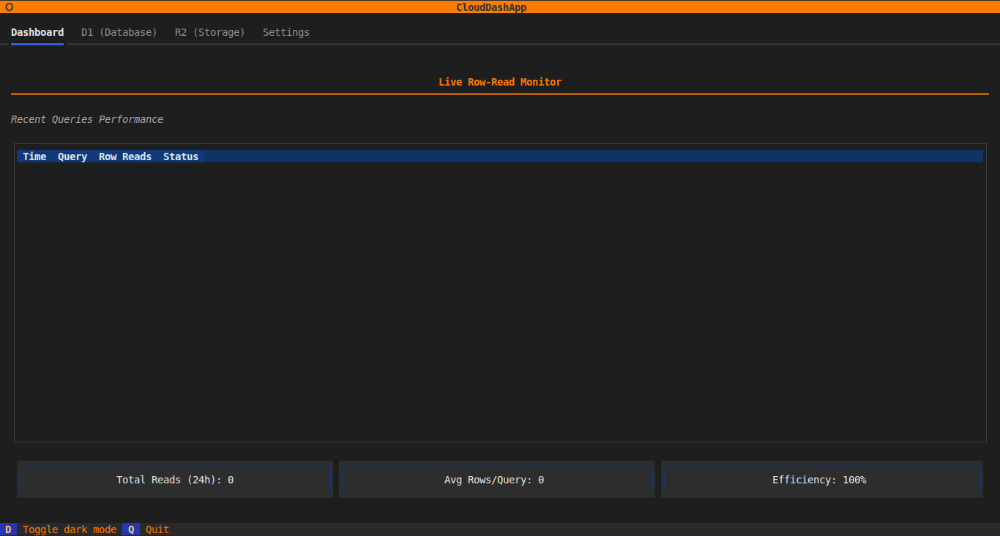

# ☁️ CloudDash: TUI for Cloudflare

A premium, high-performance **Terminal User Interface (TUI)** for managing Cloudflare D1 and R2 resources. Designed for developers who prefer the speed of the terminal over the web dashboard.

<p align="center">
  
</p>

> [!IMPORTANT]
> **Disclaimer:** This is a community-led open-source project and is **not affiliated with, authorized, maintained, or endorsed by Cloudflare, Inc.** "Cloudflare" is a registered trademark of Cloudflare, Inc.

Inspired by tools like `k9s` and `lazygit`, **CloudDash** focuses on **Performance Optimization** and **Cost Transparency** (Row Reads monitoring).


---

## ✨ Features

### 📊 Live Row-Read Monitor (Dashboard)
- **Real-time Tracking:** See exactly how many Row Reads each query consumes.
- **Cost Awareness:** Visual indicators (Green/Yellow/Red) warn you about expensive queries.
- **Query History:** Keep track of your recent activities across all databases.

### 🗄️ D1 Database Management
- **Schema Explorer:** Instantly view table structures, columns, and indexes (supports special characters and system tables).
- **SQL Sandbox:** Write and execute SQL queries with a smooth, responsive data grid.
- **Smart Explain:** Built-in integration with `EXPLAIN QUERY PLAN` that automatically detects and warns you about **Unindexed Scans**.
- **Quick Refresh:** Dedicated refresh button to sync your database list instantly.

### 📦 R2 Storage Explorer
- **Dual-Pane Interface:** Browse your local filesystem and R2 buckets side-by-side.
- **Smart Pagination:** Support for buckets with thousands of files using the **"Load More"** system.
- **Easy Navigation:** Quickly switch between buckets with the **"Back to Buckets"** shortcut.
- **Object Details:** View file sizes and keys in a clean, scrollable list.

### ⚙️ Live Configuration (Settings)
- **Status Check:** Real-time verification of your API Token and Account ID.
- **Masked Security:** Displays loaded credentials securely (masked) to confirm `.env` is working correctly.

---

## 🚀 Getting Started

### Prerequisites
- Python 3.10+
- A Cloudflare API Token (Permissions: `D1:Edit`, `R2:Edit`, `Account Settings:Read`)
- Your Cloudflare Account ID

### Installation

1. **Clone the repository:**
   ```bash
   git clone <your-repo-url>
   cd TUI
   ```

2. **Set up Virtual Environment:**
   ```bash
   python3 -m venv venv
   source venv/bin/activate
   ```

3. **Install Dependencies:**
   ```bash
   pip install -r requirements.txt
   ```

4. **Configuration:**
   Copy the example environment file and fill in your credentials:
   ```bash
   cp .env.example .env
   ```
   Edit `.env`:
   ```env
   CLOUDFLARE_API_TOKEN=your_token_here
   CLOUDFLARE_ACCOUNT_ID=your_account_id_here
   ```

### Running the App
```bash
python main.py
```

---

## ⌨️ Keyboard Shortcuts

| Key | Action |
|-----|--------|
| `Tab` | Switch between Dashboard / D1 / R2 / Settings |
| `q` / `Ctrl+C` | Quit Application |
| `d` | Toggle Dark/Light Mode |
| `Enter` | Select Database/Table, Run Query, or Load More |
| `Up/Down` | Navigate through lists and tables |

---

## 🛠️ Tech Stack
- **Framework:** [Textual](https://textual.textualize.io/) (Python TUI Framework)
- **API Client:** [HTTPX](https://www.python-httpx.org/) (Async HTTP)
- **Environment:** [Python-dotenv](https://github.com/theskumar/python-dotenv)
- **Styling:** Custom TCSS (Textual CSS)

---

## 📝 License
MIT License.

---
*Created with ❤️ by [Apisit Promma](https://github.com/pheem49) for CloudDash Developers.*
